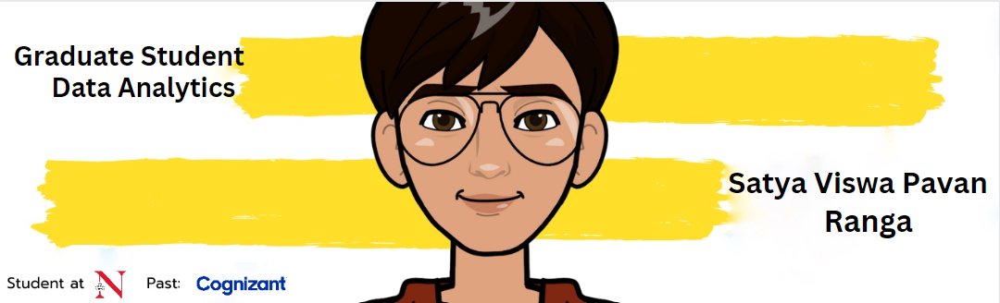

<!-- <h2 align='center'>Satya viswa pavan</h2>

<b>Graduate Student at Northeastern University, Boston</b>
 -->

<h2>Hey! 👋</h2>

  

I'm Satya viswa pavan Ranga! 
- <i>Currently:</i> MS Analytics Student at Northeastern University, Chicago. 
- <i>Previously:</i> Program Analyst at COgnizant.

<h2>💻 I'm Currently workng on</h2>

- System Design and Distributed Computing
- Software Engineering

__Check out my GitHub repository:__

  

    
    
  

<h2> About Satya⚡:</h2>

I'm a Graduate Student living in Boston, MA. Outside Tech, I love to read, enjoy music and explore nature outdoors. If you are around Boston, drop an email and let's catch-up over Coffee!
 
- Check out my Page: [https://rangasatyaviswapavan.github.io/](https://rangasatyaviswapavan.github.io/)
- Know more about me: [About Satya](https://rangasatyaviswapavan.github.io/#about)
- Write to me: [pavan.sv.ranga@gmail.com](mailto:pavan.sv.ranga@gmail.com)

<h2>📫 How to reach me:</h2>

 
