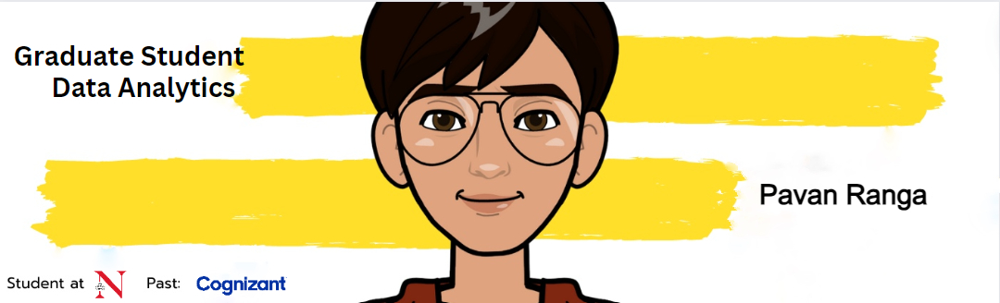

<!-- <h2 align='center'>Satya viswa pavan</h2>

<b>Graduate Student at Northeastern University, Boston</b>
 -->

<h2>Hey! 👋</h2>

  

I'm Pavan Ranga! 

<h2>💻 I'm Currently workng on</h2>

- Data communication and visualization
- Applications of Artifical intelligence

__Check out my GitHub repository:__

  

    
    
  

  

    
    
  

